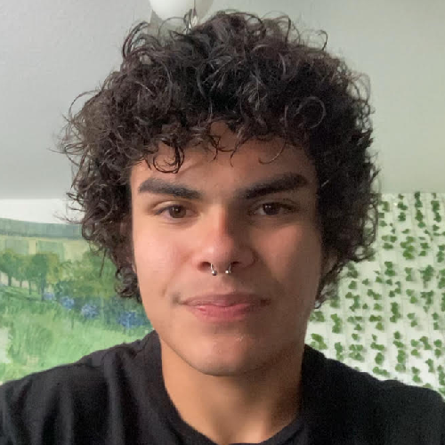

# Rafael Niebles

    

### About Me

Experienced software developer and instructor with 4+ years of experience with various programming languages and tools, most notably C, C#, Python, Unity, and Blender. Personally designed and implemented different software for a variety of purposes, including 2D graphics rendering, input parsing, embedded systems, pathfinding, and custom file format handling. 1+ year of retail sales and food service experience. Math enthusiast with competition experience. Also the receiver of personal recognition from congressman Mario Diaz-Balart for winning the annual Congressional App Challenge. Charismatic team player with an interest in building positive professional relationships, and creating a constructive work environment!

### Links

- [GitHub](https://github.com/rnieblesealo)
