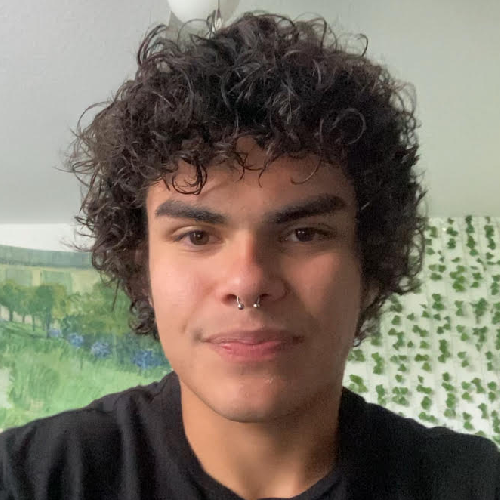

[**Projects**](/projects.md) /
[Full Resume](https://docs.google.com/document/d/14Rx3RlmTchmpJzQRuU3dtSJaIixIbBvhnhfaBt74S9Y/edit#heading=h.x8fm1uorkbaw) /
[Mockup CV](https://docs.google.com/document/d/1FveUS63I_ipMAnUaaKUlwnu4tXWkcHHRTMneVrMp8iI/edit) /
[Mini-Interview](https://drive.google.com/file/d/182D_SKKLXKEnetlOmS32SwQG73ZSdjUf/view?usp=drive_link)

# Rafael Niebles / rnieblesalo@gmail.com

    

# About Me

Experienced software developer and instructor with 4+ years of experience with various programming languages and tools, most notably C, C#, Python, Unity, and Blender. Personally designed and implemented different software for a variety of purposes, including 2D graphics rendering, input parsing, embedded systems, pathfinding, and custom file format handling. 1+ year of retail sales and food service experience. Math enthusiast with competition experience. Also the receiver of personal recognition from congressman Mario Diaz-Balart for winning the annual Congressional App Challenge. Charismatic team player with an interest in building positive professional relationships, and creating a constructive work environment!

## Education

### University of Central Florida

#### 2022 - Current

- **Significant Coursework**: Intro to Programming with C, Computer Science I, Calculus I-III, Computer Logic & Organization
- **GPA**: 3.67
- **Honors/Awards**: Dean’s List, Fall '22-Spring '24

## Work Experience

### Hot Topic, Inc.

#### Sales Associate, 2021-2022

- **Role Responsibilities**:
    - Customer service
    - Cash register Operation
    - Floor maintenance 
    - Stocking/shipment handling

### BurgerFi, Inc.

#### Cook, 2024 - Current

- **Role Responsibilities**:
    - Food prep 
    - Grill operation
    - Dishwashing
    - Frying/grill

## Volunteering

### UCF School for Children

#### Gardener, 2023

- **Role Responsibilities**:
    - Maintained backyard garden
    - organized gardening material.

## Clubs

### AI @ UCF 

#### Project Lead, Pladagio, 2023 - Current

- **Role Responsibilities**:
        Leader of AI project Pladagio, a piece of software designed to help musicians avoid legally damning plagiarism during production.

## Projects

### UCF College of Engineering & Computer Science

#### Project Lead, SPIMCore, 2023

- **Role Responsibilities**: Designed MIPS processor emulator in the C programming language.

## Technology

### Computer Programs/Tools 

- Logic Pro X, Beginner
- Adobe Photoshop, Intermediate
- Adobe Illustrator, Intermediate
- Final Cut Pro, Intermediate
- Blender, Intermediate
- Unity, Intermediate

###  Programming Languages (Beginner, Intermediate, Advanced):

- C, Intermediate
- C++, Beginner
- C#, Intermediate
- Python, Intermediate
- Java, Beginner
- Lua, Beginner

## Spoken & Written Languages

-  **English**, fluent
- **Spanish**, fluent

## Links

- [GitHub](https://github.com/rnieblesealo)
